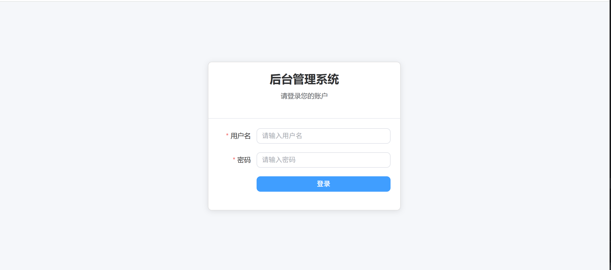

# RBAC 后台管理系统 + ERP 管理系统

## 项目简介

这是一个基于角色权限控制（RBAC）的企业级后台管理系统，集成完整的 ERP 管理功能，采用前后端分离架构。系统提供完整的用户认证、角色管理、权限控制、菜单管理以及 ERP 核心功能模块, 此系统完全采用AI编程工具开发，中间可能有一些问题，请大家多多包涵。

## 系统预览

### 登录页面


### 控制台仪表盘


### ERP统计报表


## 技术栈

### 前端
| 组件 | 技术 | 版本要求 |
|------|------|----------|
| 框架 | Vue | 3.x |
| 状态管理 | Pinia | - |
| 路由 | Vue Router | - |
| UI组件库 | Element Plus | - |
| 网络请求 | Axios | - |
| 构建工具 | Vite | - |
| 图表库 | ECharts | - |

### 后端
| 组件 | 技术 | 版本要求 |
|------|------|----------|
| 框架 | Go-zero | - |
| 语言 | Go | 1.20+ |
| 数据库 | MySQL | 8.0+ |
| ORM | GORM | v1 |
| 认证 | JWT | - |

### 服务端口
| 服务 | 端口 |
|------|------|
| 后端 API | 8000 |
| 前端开发服务器 | 3000 |

## 核心功能

### 系统管理模块
| 模块 | 功能 |
|------|------|
| 用户认证 | 登录、登出、Token刷新 |
| 用户管理 | 创建、编辑、删除、角色分配 |
| 角色管理 | 创建、编辑、删除、权限分配、菜单分配 |
| 权限管理 | 创建、编辑、删除、树形展示 |
| 菜单管理 | 创建、编辑、删除、树形结构 |
| 活动日志 | 操作记录、按用户筛选 |
| 数据权限 | 基于角色的数据访问控制 |

### ERP 管理模块
| 模块 | 功能 |
|------|------|
| 产品管理 | 产品列表、创建、编辑、删除、分类管理 |
| 供应商管理 | 供应商列表、创建、编辑、删除 |
| 客户管理 | 客户列表、创建、编辑、删除 |
| 仓库管理 | 仓库列表、创建、编辑、删除 |
| 采购管理 | 采购订单、审核、入库 |
| 销售管理 | 销售订单、审核、出库 |
| 库存管理 | 库存列表、调整申请、预警、调拨、盘点 |
| 统计报表 | 采购/销售趋势、库存预警、热销排行 |

## 项目结构

### 后端结构
```
go-zero-erp/
├── admin/                    # 后端应用
│   ├── etc/                  # 配置文件
│   │   └── admin-api.yaml    # 主配置文件
│   ├── internal/             # 内部代码
│   │   ├── config/           # 配置结构体
│   │   ├── handler/          # HTTP处理器
│   │   ├── logic/            # 业务逻辑
│   │   ├── middleware/       # 中间件（认证、CORS、数据权限）
│   │   ├── model/            # GORM数据模型
│   │   ├── svc/              # 服务上下文
│   │   ├── types/            # 请求/响应类型定义
│   │   └── util/             # 工具函数（JWT、IP获取）
│   ├── admin.api             # API定义（goctl）
│   └── admin.go              # 应用入口
├── frontend/                 # 前端应用
├── docs/                     # 项目文档
├── images/                   # 截图图片
├── test/                     # 测试脚本
├── go.mod                    # Go模块文件
└── go.sum                    # 依赖校验文件
```

### 前端结构
```
frontend/
├── src/                      # 源代码
│   ├── api/                  # API请求封装
│   ├── components/           # 公共组件
│   ├── directives/           # 自定义指令（权限指令）
│   ├── router/               # 路由配置
│   ├── store/                # Pinia状态管理
│   ├── utils/                # 工具函数
│   ├── views/                # 页面组件
│   │   ├── login/            # 登录页面
│   │   ├── dashboard/        # 控制台
│   │   ├── user/             # 用户管理
│   │   ├── role/             # 角色管理
│   │   ├── permission/       # 权限管理
│   │   ├── menu/             # 菜单管理
│   │   ├── activity/         # 活动日志
│   │   ├── product/          # 产品管理
│   │   ├── supplier/         # 供应商管理
│   │   ├── customer/         # 客户管理
│   │   ├── warehouse/        # 仓库管理
│   │   ├── purchase/         # 采购管理
│   │   ├── sales/            # 销售管理
│   │   ├── inventory/        # 库存管理
│   │   └── erp/              # ERP统计报表
│   ├── App.vue               # 根组件
│   └── main.js               # 入口文件
├── index.html                # HTML模板
├── vite.config.js            # Vite配置（含代理）
└── package.json              # 依赖管理
```

## 安装与运行

### 环境准备
1. Go 1.20+
2. Node.js 16+
3. MySQL 8.0+

### 后端启动
```bash
cd admin
go mod tidy                    # 安装依赖
go run admin.go -f etc/admin-api.yaml  # 启动服务（端口8000）
```

### 前端启动
```bash
cd frontend
npm install                    # 安装依赖
npm run dev                    # 启动开发服务器（端口3000）
npm run build                  # 构建生产版本
```

### 数据库配置
修改 `admin/etc/admin-api.yaml`：
```yaml
DataSource: root:root@tcp(127.0.0.1:3306)/admin_system?charset=utf8mb4&parseTime=True&loc=Local
```

### 初始化数据
系统启动时自动创建表结构，可通过接口初始化基础数据：
```
POST /system/init-data
```

## API接口

### 认证接口
| 方法 | 路径 | 说明 |
|------|------|------|
| POST | /auth/login | 用户登录 |
| POST | /auth/logout | 用户登出 |
| POST | /auth/refresh | 刷新Token |

### 用户管理接口
| 方法 | 路径 | 说明 |
|------|------|------|
| GET | /user/list | 获取用户列表 |
| GET | /user/get/:id | 获取用户详情 |
| POST | /user/create | 创建用户 |
| POST | /user/update | 更新用户 |
| POST | /user/delete | 删除用户 |
| POST | /user/assign-roles | 分配角色 |

### 角色管理接口
| 方法 | 路径 | 说明 |
|------|------|------|
| GET | /role/list | 获取角色列表 |
| GET | /role/get/:id | 获取角色详情 |
| POST | /role/create | 创建角色 |
| PUT | /role/update | 更新角色 |
| DELETE | /role/delete | 删除角色 |
| POST | /role/assign-permissions | 分配权限 |
| POST | /role/assign-menus | 分配菜单 |

### 权限管理接口
| 方法 | 路径 | 说明 |
|------|------|------|
| GET | /permission/list | 获取权限列表 |
| GET | /permission/get/:id | 获取权限详情 |
| POST | /permission/create | 创建权限 |
| PUT | /permission/update | 更新权限 |
| DELETE | /permission/delete | 删除权限 |

### 菜单管理接口
| 方法 | 路径 | 说明 |
|------|------|------|
| GET | /menu/tree | 获取菜单树 |
| GET | /menu/list | 获取菜单列表 |
| POST | /menu/create | 创建菜单 |
| POST | /menu/update | 更新菜单 |
| POST | /menu/delete | 删除菜单 |
| GET | /menu/get/:id | 获取菜单详情 |
| POST | /menu/assign-permissions | 分配菜单权限 |

### 活动日志接口
| 方法 | 路径 | 说明 |
|------|------|------|
| GET | /activity/list | 获取活动日志 |

### 产品管理接口
| 方法 | 路径 | 说明 |
|------|------|------|
| GET | /product/list | 获取产品列表 |
| GET | /product/get/:id | 获取产品详情 |
| POST | /product/create | 创建产品 |
| POST | /product/update | 更新产品 |
| POST | /product/delete | 删除产品 |
| GET | /product/category/list | 获取分类列表 |
| POST | /product/category/create | 创建分类 |

### 供应商管理接口
| 方法 | 路径 | 说明 |
|------|------|------|
| GET | /supplier/list | 获取供应商列表 |
| GET | /supplier/get/:id | 获取供应商详情 |
| POST | /supplier/create | 创建供应商 |
| POST | /supplier/update | 更新供应商 |
| POST | /supplier/delete | 删除供应商 |

### 客户管理接口
| 方法 | 路径 | 说明 |
|------|------|------|
| GET | /customer/list | 获取客户列表 |
| GET | /customer/get/:id | 获取客户详情 |
| POST | /customer/create | 创建客户 |
| POST | /customer/update | 更新客户 |
| POST | /customer/delete | 删除客户 |

### 仓库管理接口
| 方法 | 路径 | 说明 |
|------|------|------|
| GET | /warehouse/list | 获取仓库列表 |
| GET | /warehouse/get/:id | 获取仓库详情 |
| POST | /warehouse/create | 创建仓库 |
| POST | /warehouse/update | 更新仓库 |
| POST | /warehouse/delete | 删除仓库 |

### 采购管理接口
| 方法 | 路径 | 说明 |
|------|------|------|
| GET | /purchase/list | 获取采购订单列表 |
| GET | /purchase/get/:id | 获取采购订单详情 |
| POST | /purchase/create | 创建采购订单 |
| POST | /purchase/update | 更新采购订单 |
| POST | /purchase/delete | 删除采购订单 |
| POST | /purchase/approve | 审核采购订单 |
| POST | /purchase/inbound | 采购入库 |

### 销售管理接口
| 方法 | 路径 | 说明 |
|------|------|------|
| GET | /sales/list | 获取销售订单列表 |
| GET | /sales/get/:id | 获取销售订单详情 |
| POST | /sales/create | 创建销售订单 |
| POST | /sales/update | 更新销售订单 |
| POST | /sales/delete | 删除销售订单 |
| POST | /sales/approve | 审核销售订单 |
| POST | /sales/outbound | 销售出库 |

### 库存管理接口
| 方法 | 路径 | 说明 |
|------|------|------|
| GET | /inventory/list | 获取库存列表 |
| GET | /inventory/history | 获取库存历史 |
| GET | /inventory/current-stock | 获取当前库存 |
| POST | /inventory/adjust-request/create | 创建库存调整申请 |
| GET | /inventory/adjust-request/list | 获取调整申请列表 |
| POST | /inventory/adjust-request/approve | 审核调整申请 |
| POST | /inventory/adjust-request/reject | 拒绝调整申请 |
| POST | /inventory/transfer/create | 创建库存调拨单 |
| POST | /inventory/check/create | 创建库存盘点单 |

### ERP统计报表接口
| 方法 | 路径 | 说明 |
|------|------|------|
| GET | /erp/statistics/overview | 获取概览统计 |
| GET | /erp/statistics/trend | 获取采购/销售趋势 |
| GET | /erp/statistics/inventory-alert | 获取库存预警 |
| GET | /erp/statistics/top-products | 获取热销商品 |
| GET | /erp/statistics/order-status | 获取订单状态 |
| GET | /erp/statistics/business | 获取业务统计 |

### 系统接口
| 方法 | 路径 | 说明 |
|------|------|------|
| POST | /system/init-data | 初始化数据 |

## 默认账号

| 用户名 | 密码 | 角色 |
|--------|------|------|
| admin | admin123 | 超级管理员 |

## 权限说明

### 权限编码规范
```
{模块}:{操作}

示例:
- btn_user_create    # 创建用户
- btn_user_update    # 更新用户
- btn_role_assign    # 分配角色权限
```

### 数据权限
- **管理员**：可查看所有数据
- **普通用户**：只能查看自己角色范围内的数据

## 安全注意

1. JWT密钥默认使用 `your-secret-key`，生产环境请修改
2. CORS当前允许所有来源，生产环境请限制
3. 密码使用 bcrypt 加密存储
4. 建议生产环境启用HTTPS

## 许可证

MIT License