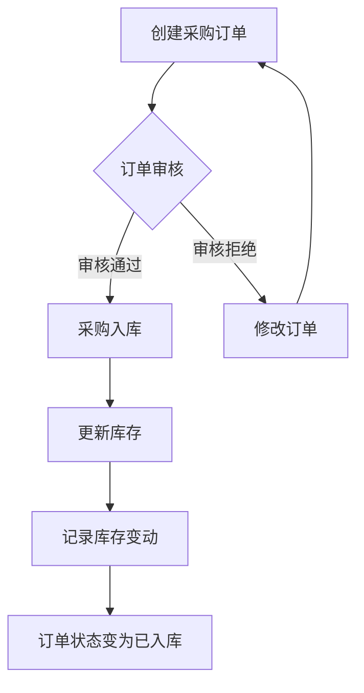
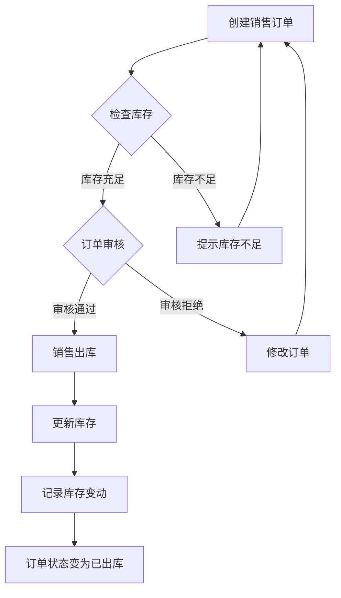
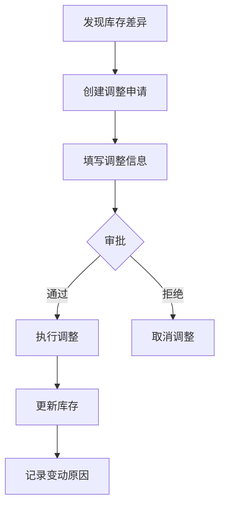
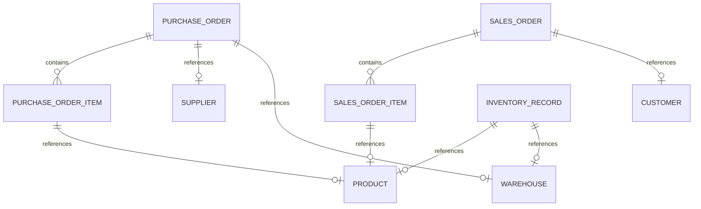

# ERP进销存系统需求文档

## 1. 项目背景与目标

### 1.1 业务背景
ERP进销存系统是企业资源管理的核心模块，旨在帮助企业实现采购、销售、库存的全流程数字化管理，提升运营效率，降低成本，优化供应链协同。

### 1.2 项目目标
- 实现采购订单的全流程管理（创建→审核→入库）
- 实现销售订单的全流程管理（创建→审核→出库）
- 实现库存的实时监控与智能调整
- 建立完善的产品、供应商、客户基础数据管理体系
- 提供完整的数据统计与报表功能

### 1.3 项目范围
- **采购管理**：供应商管理、采购订单、采购入库
- **销售管理**：客户管理、销售订单、销售出库
- **库存管理**：库存查询、库存变动、库存调整
- **产品管理**：产品信息、分类管理

### 1.4 成功指标
| 指标 | 目标值 |
|------|--------|
| 采购订单处理效率提升 | 30% |
| 库存周转率提升 | 20% |
| 订单准确率 | 99.9% |
| 库存盘点时间缩短 | 50% |

---

## 2. 用户画像与核心场景

### 2.1 目标用户群体

| 用户角色 | 职责描述 | 系统需求 |
|----------|----------|----------|
| **采购专员** | 负责采购订单的创建、跟踪 | 创建采购订单、查看订单状态、执行入库 |
| **销售专员** | 负责销售订单的创建、跟踪 | 创建销售订单、查看订单状态、执行出库 |
| **仓库管理员** | 负责库存管理、出入库操作 | 执行入库、出库、库存调整、盘点 |
| **财务人员** | 负责财务核算 | 查看订单金额、统计报表 |
| **系统管理员** | 负责系统配置、权限管理 | 基础数据维护、用户权限管理 |

### 2.2 用户痛点分析

| 用户角色 | 痛点 | 解决方案 |
|----------|------|----------|
| 采购专员 | 手动记录采购订单，容易出错 | 系统化采购订单管理，自动生成订单编号 |
| 销售专员 | 无法实时了解库存情况 | 实时库存查询，库存预警 |
| 仓库管理员 | 库存盘点耗时费力 | 库存变动自动记录，支持批量盘点 |
| 财务人员 | 对账困难，数据分散 | 统一数据报表，自动汇总 |

### 2.3 核心使用场景

**场景1：采购入库流程**
- 采购专员根据需求创建采购订单
- 主管审核采购订单
- 仓库管理员收到货物后执行入库
- 系统自动更新库存

**场景2：销售出库流程**
- 销售专员根据客户需求创建销售订单
- 系统自动检查库存是否充足
- 主管审核销售订单
- 仓库管理员执行出库
- 系统自动更新库存

**场景3：库存调整**
- 仓库管理员发现库存差异
- 创建库存调整单
- 系统记录调整原因和变动情况

---

## 3. 功能列表（附优先级）

### 3.1 P0 - 核心功能

| 功能模块 | 功能点 | 描述 | 验收标准 |
|----------|--------|------|----------|
| **产品管理** | 产品列表 | 展示所有产品信息 | 支持分页、搜索、筛选 |
| | 产品创建 | 创建新产品 | 必填字段校验、编码唯一 |
| | 产品编辑 | 修改产品信息 | 支持更新所有字段 |
| | 产品删除 | 删除产品 | 关联订单的产品不可删除 |
| | 分类管理 | 产品分类树形结构 | 支持多级分类 |
| **供应商管理** | 供应商列表 | 展示所有供应商 | 支持分页、搜索 |
| | 供应商创建 | 创建新供应商 | 必填字段校验、编码唯一 |
| | 供应商编辑 | 修改供应商信息 | 支持更新所有字段 |
| | 供应商删除 | 删除供应商 | 有关联订单不可删除 |
| **客户管理** | 客户列表 | 展示所有客户 | 支持分页、搜索 |
| | 客户创建 | 创建新客户 | 必填字段校验、编码唯一 |
| | 客户编辑 | 修改客户信息 | 支持更新所有字段 |
| | 客户删除 | 删除客户 | 有关联订单不可删除 |
| **仓库管理** | 仓库列表 | 展示所有仓库 | 支持分页、搜索 |
| | 仓库创建 | 创建新仓库 | 必填字段校验、编码唯一 |
| | 仓库编辑 | 修改仓库信息 | 支持更新所有字段 |
| | 仓库删除 | 删除仓库 | 有库存不可删除 |
| **采购订单** | 创建订单 | 创建采购订单及明细 | 自动计算总金额 |
| | 订单审核 | 审核采购订单 | 只能审核待审核状态 |
| | 采购入库 | 执行采购入库 | 更新库存数量 |
| | 订单列表 | 展示所有采购订单 | 支持状态筛选 |
| **销售订单** | 创建订单 | 创建销售订单及明细 | 自动检查库存 |
| | 订单审核 | 审核销售订单 | 只能审核待审核状态 |
| | 销售出库 | 执行销售出库 | 更新库存数量 |
| | 订单列表 | 展示所有销售订单 | 支持状态筛选 |
| **库存管理** | 库存查询 | 查询各仓库库存 | 支持产品、仓库筛选 |
| | 库存调整 | 手动调整库存 | 记录调整原因 |
| | 库存历史 | 查看库存变动记录 | 支持按产品、仓库筛选 |

### 3.2 P1 - 重要功能

| 功能模块 | 功能点 | 描述 | 验收标准 |
|----------|--------|------|----------|
| **采购订单** | 订单取消 | 取消待审核订单 | 已入库订单不可取消 |
| | 订单详情 | 查看订单详细信息 | 展示订单状态变更记录 |
| **销售订单** | 订单取消 | 取消待审核订单 | 已出库订单不可取消 |
| | 订单详情 | 查看订单详细信息 | 展示订单状态变更记录 |
| **库存管理** | 库存预警 | 设置库存上下限 | 低于下限自动提醒 |
| | 库存盘点 | 批量盘点库存 | 生成盘点差异报告 |
| **报表统计** | 采购报表 | 采购金额统计 | 按时间、供应商汇总 |
| | 销售报表 | 销售金额统计 | 按时间、客户汇总 |
| | 库存报表 | 库存金额统计 | 按仓库、产品分类汇总 |

### 3.3 P2 - 增值功能

| 功能模块 | 功能点 | 描述 | 验收标准 |
|----------|--------|------|----------|
| **采购订单** | 订单导入 | 批量导入采购订单 | 支持Excel格式 |
| **销售订单** | 订单导出 | 导出销售订单 | 支持Excel格式 |
| **库存管理** | 库存调拨 | 仓库间库存调拨 | 更新源仓库和目标仓库库存 |
| **系统集成** | 财务接口 | 对接财务系统 | 自动同步应收应付 |
| | 条码管理 | 扫码出入库 | 支持条码枪扫描 |

---

## 4. 数据模型设计

### 4.1 核心实体关系图

```
┌─────────────┐     ┌─────────────┐     ┌─────────────┐
│  Supplier   │     │  Customer   │     │  Warehouse  │
└──────┬──────┘     └──────┬──────┘     └──────┬──────┘
       │                    │                    │
       │ 1:N                │ 1:N                │ 1:N
       ▼                    ▼                    ▼
┌─────────────┐     ┌─────────────┐     ┌─────────────┐
│PurchaseOrder│     │ SalesOrder  │     │InventoryRec │
└──────┬──────┘     └──────┬──────┘     └──────┬──────┘
       │                    │                    │
       │ 1:N                │ 1:N                │ M:N
       ▼                    ▼                    ▼
┌─────────────────┐ ┌─────────────────┐ ┌─────────────┐
│PurchaseOrderItem│ │ SalesOrderItem  │ │   Product   │
└─────────────────┘ └─────────────────┘ └──────┬──────┘
                                               │
                                               │ 1:N
                                               ▼
                                      ┌─────────────┐
                                      │  Category   │
                                      └─────────────┘
```

### 4.2 核心数据表结构

#### 4.2.1 产品表 (products)

| 字段名 | 类型 | 约束 | 说明 |
|--------|------|------|------|
| id | uint | PRIMARY KEY | 主键 |
| name | varchar(100) | NOT NULL, INDEX | 产品名称 |
| code | varchar(50) | NOT NULL, UNIQUE, INDEX | 产品编码 |
| category_id | uint | INDEX | 分类ID |
| spec | varchar(100) | | 规格型号 |
| unit | varchar(20) | DEFAULT '件' | 计量单位 |
| price | decimal(10,2) | NOT NULL | 销售价格 |
| cost_price | decimal(10,2) | | 成本价格 |
| stock | int | DEFAULT 0 | 当前库存 |
| desc | varchar(500) | | 产品描述 |
| status | int | DEFAULT 1, INDEX | 状态(1:启用,0:禁用) |
| created_at | datetime | | 创建时间 |
| updated_at | datetime | | 更新时间 |
| deleted_at | datetime | INDEX | 软删除时间 |

#### 4.2.2 产品分类表 (categories)

| 字段名 | 类型 | 约束 | 说明 |
|--------|------|------|------|
| id | uint | PRIMARY KEY | 主键 |
| name | varchar(50) | NOT NULL, INDEX | 分类名称 |
| code | varchar(50) | NOT NULL, UNIQUE, INDEX | 分类编码 |
| parent_id | uint | INDEX | 父分类ID |
| sort | int | DEFAULT 0 | 排序号 |
| status | int | DEFAULT 1, INDEX | 状态 |
| desc | varchar(255) | | 分类描述 |
| created_at | datetime | | 创建时间 |
| updated_at | datetime | | 更新时间 |
| deleted_at | datetime | INDEX | 软删除时间 |

#### 4.2.3 供应商表 (suppliers)

| 字段名 | 类型 | 约束 | 说明 |
|--------|------|------|------|
| id | uint | PRIMARY KEY | 主键 |
| name | varchar(100) | NOT NULL, UNIQUE, INDEX | 供应商名称 |
| code | varchar(50) | UNIQUE, INDEX | 供应商编码 |
| contact | varchar(50) | | 联系人 |
| phone | varchar(20) | | 联系电话 |
| email | varchar(100) | | 邮箱 |
| address | varchar(200) | | 地址 |
| desc | text | | 备注描述 |
| status | int | DEFAULT 1, INDEX | 状态 |
| created_at | datetime | | 创建时间 |
| updated_at | datetime | | 更新时间 |
| deleted_at | datetime | INDEX | 软删除时间 |

#### 4.2.4 客户表 (customers)

| 字段名 | 类型 | 约束 | 说明 |
|--------|------|------|------|
| id | uint | PRIMARY KEY | 主键 |
| name | varchar(100) | NOT NULL, UNIQUE, INDEX | 客户名称 |
| code | varchar(50) | UNIQUE, INDEX | 客户编码 |
| contact | varchar(50) | | 联系人 |
| phone | varchar(20) | | 联系电话 |
| email | varchar(100) | | 邮箱 |
| address | varchar(200) | | 地址 |
| desc | text | | 备注描述 |
| status | int | DEFAULT 1, INDEX | 状态 |
| created_at | datetime | | 创建时间 |
| updated_at | datetime | | 更新时间 |
| deleted_at | datetime | INDEX | 软删除时间 |

#### 4.2.5 仓库表 (warehouses)

| 字段名 | 类型 | 约束 | 说明 |
|--------|------|------|------|
| id | uint | PRIMARY KEY | 主键 |
| name | varchar(50) | NOT NULL, UNIQUE, INDEX | 仓库名称 |
| code | varchar(50) | UNIQUE, INDEX | 仓库编码 |
| address | varchar(200) | | 仓库地址 |
| contact | varchar(50) | | 联系人 |
| phone | varchar(20) | | 联系电话 |
| desc | text | | 备注描述 |
| status | int | DEFAULT 1, INDEX | 状态 |
| created_at | datetime | | 创建时间 |
| updated_at | datetime | | 更新时间 |
| deleted_at | datetime | INDEX | 软删除时间 |

#### 4.2.6 采购订单表 (purchase_orders)

| 字段名 | 类型 | 约束 | 说明 |
|--------|------|------|------|
| id | uint | PRIMARY KEY | 主键 |
| order_no | varchar(50) | NOT NULL, UNIQUE, INDEX | 订单编号 |
| supplier_id | uint | INDEX | 供应商ID |
| warehouse_id | uint | INDEX | 入库仓库ID |
| total_amount | decimal(12,2) | NOT NULL | 订单总金额 |
| status | int | DEFAULT 1, INDEX | 状态(1:待审核,2:已审核,3:已入库,4:已取消) |
| remark | varchar(500) | | 备注 |
| created_at | datetime | | 创建时间 |
| updated_at | datetime | | 更新时间 |
| deleted_at | datetime | INDEX | 软删除时间 |

#### 4.2.7 采购订单项表 (purchase_order_items)

| 字段名 | 类型 | 约束 | 说明 |
|--------|------|------|------|
| id | uint | PRIMARY KEY | 主键 |
| order_id | uint | INDEX | 订单ID |
| product_id | uint | INDEX | 产品ID |
| quantity | int | NOT NULL | 采购数量 |
| unit_price | decimal(10,2) | NOT NULL | 单价 |
| amount | decimal(12,2) | NOT NULL | 金额 |
| created_at | datetime | | 创建时间 |
| updated_at | datetime | | 更新时间 |
| deleted_at | datetime | INDEX | 软删除时间 |

#### 4.2.8 销售订单表 (sales_orders)

| 字段名 | 类型 | 约束 | 说明 |
|--------|------|------|------|
| id | uint | PRIMARY KEY | 主键 |
| order_no | varchar(50) | NOT NULL, UNIQUE, INDEX | 订单编号 |
| customer_id | uint | INDEX | 客户ID |
| total_amount | decimal(12,2) | NOT NULL | 订单总金额 |
| status | int | DEFAULT 1, INDEX | 状态(1:待审核,2:已审核,3:已出库,4:已取消) |
| remark | varchar(500) | | 备注 |
| created_at | datetime | | 创建时间 |
| updated_at | datetime | | 更新时间 |
| deleted_at | datetime | INDEX | 软删除时间 |

#### 4.2.9 销售订单项表 (sales_order_items)

| 字段名 | 类型 | 约束 | 说明 |
|--------|------|------|------|
| id | uint | PRIMARY KEY | 主键 |
| order_id | uint | INDEX | 订单ID |
| product_id | uint | INDEX | 产品ID |
| quantity | int | NOT NULL | 销售数量 |
| unit_price | decimal(10,2) | NOT NULL | 单价 |
| amount | decimal(12,2) | NOT NULL | 金额 |
| created_at | datetime | | 创建时间 |
| updated_at | datetime | | 更新时间 |
| deleted_at | datetime | INDEX | 软删除时间 |

#### 4.2.10 库存记录表 (inventory_records)

| 字段名 | 类型 | 约束 | 说明 |
|--------|------|------|------|
| id | uint | PRIMARY KEY | 主键 |
| product_id | uint | INDEX | 产品ID |
| warehouse_id | uint | INDEX | 仓库ID |
| quantity | int | DEFAULT 0 | 当前库存数量 |
| created_at | datetime | | 创建时间 |
| updated_at | datetime | | 更新时间 |
| deleted_at | datetime | INDEX | 软删除时间 |

#### 4.2.11 库存变动表 (inventory_changes)

| 字段名 | 类型 | 约束 | 说明 |
|--------|------|------|------|
| id | uint | PRIMARY KEY | 主键 |
| product_id | uint | INDEX | 产品ID |
| warehouse_id | uint | INDEX | 仓库ID |
| before_quantity | int | | 变动前数量 |
| after_quantity | int | | 变动后数量 |
| quantity | int | NOT NULL | 变动数量 |
| type | int | INDEX | 变动类型(1:入库,2:出库,3:调整) |
| order_id | uint | | 关联订单ID |
| remark | varchar(500) | | 变动原因 |
| created_at | datetime | | 创建时间 |

### 4.3 关系表设计

| 关系表 | 关联实体 | 说明 |
|--------|----------|------|
| user_roles | User ↔ Role | 用户角色关联 |
| role_permissions | Role ↔ Permission | 角色权限关联 |
| role_menus | Role ↔ Menu | 角色菜单关联 |
| menu_permissions | Menu ↔ Permission | 菜单权限关联 |

---

## 5. 业务流程设计

### 5.1 采购流程



**流程说明：**

| 步骤 | 操作 | 角色 | 说明 |
|------|------|------|------|
| 1 | 创建采购订单 | 采购专员 | 选择供应商、仓库，添加订单项 |
| 2 | 审核订单 | 采购主管 | 审核订单金额、数量等信息 |
| 3 | 修改订单 | 采购专员 | 审核不通过时修改订单 |
| 4 | 采购入库 | 仓库管理员 | 确认收货，执行入库操作 |
| 5 | 更新库存 | 系统 | 自动更新库存记录表 |
| 6 | 记录变动 | 系统 | 生成库存变动记录 |

### 5.2 销售流程



**流程说明：**

| 步骤 | 操作 | 角色 | 说明 |
|------|------|------|------|
| 1 | 创建销售订单 | 销售专员 | 选择客户，添加订单项 |
| 2 | 检查库存 | 系统 | 自动检查库存是否充足 |
| 3 | 审核订单 | 销售主管 | 审核订单信息 |
| 4 | 修改订单 | 销售专员 | 审核不通过时修改订单 |
| 5 | 销售出库 | 仓库管理员 | 执行出库操作 |
| 6 | 更新库存 | 系统 | 自动扣减库存 |
| 7 | 记录变动 | 系统 | 生成库存变动记录 |

### 5.3 库存调整流程



**流程说明：**

| 步骤 | 操作 | 角色 | 说明 |
|------|------|------|------|
| 1 | 发现库存差异 | 仓库管理员 | 盘点时发现实际库存与系统不符 |
| 2 | 创建调整申请 | 仓库管理员 | 填写调整原因、调整数量 |
| 3 | 审批 | 主管 | 审核调整申请 |
| 4 | 执行调整 | 仓库管理员 | 确认执行库存调整 |
| 5 | 更新库存 | 系统 | 自动更新库存数量 |
| 6 | 记录变动 | 系统 | 生成库存变动记录 |

---

## 6. 复杂关联联动关系

### 6.1 订单与产品、仓库的关联



### 6.2 库存变动与订单的关联

| 变动类型 | 关联订单 | 影响 |
|----------|----------|------|
| 采购入库 | 采购订单 | 库存增加 |
| 销售出库 | 销售订单 | 库存减少 |
| 库存调整 | 无 | 库存增加或减少 |

### 6.3 供应商/客户与订单的关联

| 实体 | 关联订单类型 | 说明 |
|------|--------------|------|
| 供应商 | 采购订单 | 一个供应商可关联多个采购订单 |
| 客户 | 销售订单 | 一个客户可关联多个销售订单 |

### 6.4 数据联动规则

**采购入库联动：**
1. 采购订单审核通过后，仓库管理员执行入库
2. 系统自动更新对应仓库的库存数量
3. 生成库存变动记录，关联采购订单ID

**销售出库联动：**
1. 销售订单审核通过后，仓库管理员执行出库
2. 系统自动扣减库存数量
3. 生成库存变动记录，关联销售订单ID

**库存预警联动：**
1. 当库存低于预警值时，系统自动提醒
2. 可配置自动生成采购建议

---

## 7. API接口设计

### 7.1 采购管理接口

| 接口路径 | HTTP方法 | 功能描述 | 认证要求 |
|----------|----------|----------|----------|
| /purchase/create | POST | 创建采购订单 | 是 |
| /purchase/update | POST | 更新采购订单 | 是 |
| /purchase/delete | POST | 删除采购订单 | 是 |
| /purchase/get/:id | GET | 获取采购订单详情 | 是 |
| /purchase/list | GET | 获取采购订单列表 | 是 |
| /purchase/inbound | POST | 采购入库 | 是 |

### 7.2 销售管理接口

| 接口路径 | HTTP方法 | 功能描述 | 认证要求 |
|----------|----------|----------|----------|
| /sales/create | POST | 创建销售订单 | 是 |
| /sales/update | POST | 更新销售订单 | 是 |
| /sales/delete | POST | 删除销售订单 | 是 |
| /sales/get/:id | GET | 获取销售订单详情 | 是 |
| /sales/list | GET | 获取销售订单列表 | 是 |
| /sales/outbound | POST | 销售出库 | 是 |

### 7.3 库存管理接口

| 接口路径 | HTTP方法 | 功能描述 | 认证要求 |
|----------|----------|----------|----------|
| /inventory/list | GET | 获取库存列表 | 是 |
| /inventory/adjust | POST | 库存调整 | 是 |
| /inventory/get/:id | GET | 获取库存详情 | 是 |
| /inventory/history | GET | 获取库存变动历史 | 是 |

### 7.4 产品管理接口

| 接口路径 | HTTP方法 | 功能描述 | 认证要求 |
|----------|----------|----------|----------|
| /product/create | POST | 创建产品 | 是 |
| /product/update | POST | 更新产品 | 是 |
| /product/delete | POST | 删除产品 | 是 |
| /product/get/:id | GET | 获取产品详情 | 是 |
| /product/list | GET | 获取产品列表 | 是 |

### 7.5 分类管理接口

| 接口路径 | HTTP方法 | 功能描述 | 认证要求 |
|----------|----------|----------|----------|
| /category/create | POST | 创建分类 | 是 |
| /category/update | POST | 更新分类 | 是 |
| /category/delete | POST | 删除分类 | 是 |
| /category/get/:id | GET | 获取分类详情 | 是 |
| /category/list | GET | 获取分类列表 | 是 |

### 7.6 供应商管理接口

| 接口路径 | HTTP方法 | 功能描述 | 认证要求 |
|----------|----------|----------|----------|
| /supplier/create | POST | 创建供应商 | 是 |
| /supplier/update | POST | 更新供应商 | 是 |
| /supplier/delete | POST | 删除供应商 | 是 |
| /supplier/get/:id | GET | 获取供应商详情 | 是 |
| /supplier/list | GET | 获取供应商列表 | 是 |

### 7.7 客户管理接口

| 接口路径 | HTTP方法 | 功能描述 | 认证要求 |
|----------|----------|----------|----------|
| /customer/create | POST | 创建客户 | 是 |
| /customer/update | POST | 更新客户 | 是 |
| /customer/delete | POST | 删除客户 | 是 |
| /customer/get/:id | GET | 获取客户详情 | 是 |
| /customer/list | GET | 获取客户列表 | 是 |

### 7.8 仓库管理接口

| 接口路径 | HTTP方法 | 功能描述 | 认证要求 |
|----------|----------|----------|----------|
| /warehouse/create | POST | 创建仓库 | 是 |
| /warehouse/update | POST | 更新仓库 | 是 |
| /warehouse/delete | POST | 删除仓库 | 是 |
| /warehouse/get/:id | GET | 获取仓库详情 | 是 |
| /warehouse/list | GET | 获取仓库列表 | 是 |

---

## 8. 异常场景处理

### 8.1 网络异常处理

| 场景 | 处理方式 | 用户提示 |
|------|----------|----------|
| 网络请求超时 | 自动重试3次 | "网络请求超时，请稍后重试" |
| 网络连接失败 | 提示检查网络 | "网络连接失败，请检查网络设置" |
| 服务端错误 | 记录日志，提示用户 | "系统繁忙，请稍后重试" |

### 8.2 数据异常处理

| 场景 | 处理方式 | 用户提示 |
|------|----------|----------|
| 库存不足出库 | 阻止操作 | "库存不足，无法出库" |
| 重复订单编号 | 自动生成新编号 | "订单编号已存在，已自动生成新编号" |
| 产品不存在 | 验证失败 | "产品不存在，请选择正确的产品" |
| 供应商不存在 | 验证失败 | "供应商不存在，请选择正确的供应商" |

### 8.3 用户操作异常处理

| 场景 | 处理方式 | 用户提示 |
|------|----------|----------|
| 删除有关联的产品 | 阻止删除 | "该产品存在关联订单，无法删除" |
| 删除有库存的仓库 | 阻止删除 | "该仓库存在库存，无法删除" |
| 取消已入库订单 | 阻止操作 | "订单已入库，无法取消" |
| 出库数量超过订单数量 | 阻止操作 | "出库数量不能超过订单数量" |

### 8.4 系统异常处理

| 场景 | 处理方式 | 用户提示 |
|------|----------|----------|
| 数据库连接失败 | 记录日志，重试连接 | "系统维护中，请稍后重试" |
| 并发更新冲突 | 乐观锁处理 | "数据已被其他用户修改，请刷新后重试" |
| 数据校验失败 | 返回错误详情 | 具体字段校验错误信息 |

---

## 9. 数据埋点需求

### 9.1 用户行为数据收集

| 埋点名称 | 触发时机 | 收集字段 |
|----------|----------|----------|
| 采购订单创建 | 点击保存按钮 | user_id, timestamp, order_type |
| 采购订单审核 | 点击审核按钮 | user_id, order_id, status |
| 采购入库 | 点击入库按钮 | user_id, order_id, warehouse_id |
| 销售订单创建 | 点击保存按钮 | user_id, timestamp, order_type |
| 销售订单审核 | 点击审核按钮 | user_id, order_id, status |
| 销售出库 | 点击出库按钮 | user_id, order_id, warehouse_id |
| 库存调整 | 点击确认调整 | user_id, product_id, quantity, type |
| 产品查询 | 执行搜索 | user_id, keyword, result_count |

### 9.2 业务指标监控

| 指标名称 | 计算方式 | 监控频率 |
|----------|----------|----------|
| 采购订单数量 | 每日新增采购订单数 | 每日 |
| 销售订单数量 | 每日新增销售订单数 | 每日 |
| 库存周转率 | 出库金额/平均库存金额 | 每月 |
| 订单审核通过率 | 通过订单数/总订单数 | 每日 |
| 库存准确率 | 盘点正确数量/总盘点数量 | 每月 |

### 9.3 性能指标追踪

| 指标名称 | 说明 | 阈值 |
|----------|------|------|
| 接口响应时间 | API接口平均响应时间 | < 500ms |
| 页面加载时间 | 页面平均加载时间 | < 2s |
| 数据库查询时间 | 数据库查询平均耗时 | < 100ms |
| 系统可用性 | 系统可用时间/总时间 | > 99.9% |

---

## 10. 验收标准

### 10.1 功能验收标准

| 功能模块 | 验收要点 |
|----------|----------|
| 采购管理 | 订单创建成功、审核流程正常、入库更新库存正确 |
| 销售管理 | 订单创建成功、库存检查有效、出库扣减库存正确 |
| 库存管理 | 库存查询准确、调整记录完整、预警功能正常 |
| 产品管理 | 产品CRUD正常、分类树形结构正确 |
| 供应商管理 | 供应商CRUD正常、关联订单校验有效 |
| 客户管理 | 客户CRUD正常、关联订单校验有效 |
| 仓库管理 | 仓库CRUD正常、库存关联校验有效 |

### 10.2 性能验收标准

| 指标 | 验收标准 |
|------|----------|
| 接口响应时间 | 平均响应时间 < 500ms |
| 页面加载时间 | 平均加载时间 < 2s |
| 并发处理能力 | 支持100+并发用户 |

### 10.3 用户体验验收标准

| 指标 | 验收标准 |
|------|----------|
| 操作便捷性 | 常用功能3步内完成 |
| 错误提示 | 错误信息清晰、可操作 |
| 界面美观 | 符合Element Plus风格 |

### 10.4 兼容性验收标准

| 浏览器 | 版本要求 |
|--------|----------|
| Chrome | ≥ 90 |
| Firefox | ≥ 88 |
| Safari | ≥ 14 |
| Edge | ≥ 90 |

---

## 11. 权限需求

### 11.1 功能权限矩阵

| 功能模块 | 采购专员 | 销售专员 | 仓库管理员 | 财务人员 | 系统管理员 |
|----------|----------|----------|------------|----------|------------|
| 产品管理 | 查看 | 查看 | 查看 | 查看 | 全部 |
| 分类管理 | - | - | - | - | 全部 |
| 供应商管理 | 全部 | 查看 | 查看 | 查看 | 全部 |
| 客户管理 | 查看 | 全部 | 查看 | 查看 | 全部 |
| 仓库管理 | 查看 | 查看 | 全部 | 查看 | 全部 |
| 采购订单 | 全部 | - | 入库 | 查看 | 全部 |
| 销售订单 | - | 全部 | 出库 | 查看 | 全部 |
| 库存管理 | - | - | 全部 | 查看 | 全部 |
| 用户管理 | - | - | - | - | 全部 |
| 角色管理 | - | - | - | - | 全部 |

### 11.2 权限编码规范

```
{模块}:{操作}

模块名: product, category, supplier, customer, warehouse, purchase, sales, inventory
操作: list, create, update, delete, audit, inbound, outbound, adjust

示例:
- product:list      # 查看产品列表
- purchase:create   # 创建采购订单
- purchase:audit    # 审核采购订单
- purchase:inbound  # 采购入库
- sales:create      # 创建销售订单
- sales:audit       # 审核销售订单
- sales:outbound    # 销售出库
- inventory:adjust  # 库存调整
```

---

## 12. 数据字典

### 12.1 状态码定义

| 状态码 | 含义 | 适用场景 |
|--------|------|----------|
| 0 | 成功 | 所有成功操作 |
| 400 | 请求参数错误 | 参数校验失败 |
| 401 | 未认证 | Token无效或过期 |
| 403 | 无权限 | 权限校验失败 |
| 404 | 资源不存在 | 查询资源不存在 |
| 500 | 服务器内部错误 | 系统异常 |

### 12.2 订单状态定义

| 状态码 | 状态名称 | 说明 |
|--------|----------|------|
| 1 | 待审核 | 订单创建后等待审核 |
| 2 | 已审核 | 订单审核通过 |
| 3 | 已完成 | 采购订单已入库/销售订单已出库 |
| 4 | 已取消 | 订单被取消 |

### 12.3 库存变动类型定义

| 类型码 | 类型名称 | 说明 |
|--------|----------|------|
| 1 | 入库 | 采购入库增加库存 |
| 2 | 出库 | 销售出库减少库存 |
| 3 | 调整 | 手动调整库存 |

---

## 13. 技术方案要点

### 13.1 技术架构

- **后端框架**: Go + go-zero
- **前端框架**: Vue 3 + Element Plus
- **数据库**: MySQL 8.0+
- **认证方式**: JWT
- **状态管理**: Pinia

### 13.2 关键设计

**数据库设计原则**:
- 使用软删除，保留历史数据
- 建立适当索引，优化查询性能
- 使用事务保证数据一致性

**API设计原则**:
- RESTful风格接口
- 统一响应格式
- 参数校验在API层完成

**安全设计**:
- JWT Token过期时间设置合理
- 密码使用bcrypt加密
- SQL注入防护
- XSS攻击防护

---

## 14. 部署与集成

### 14.1 环境要求

| 环境 | 要求 |
|------|------|
| Go | ≥ 1.21 |
| Node.js | ≥ 18 |
| MySQL | ≥ 8.0 |

### 14.2 部署步骤

1. 配置数据库连接信息
2. 执行数据库迁移
3. 启动后端服务 (`go run admin.go -f etc/admin-api.yaml`)
4. 启动前端服务 (`npm run dev`)

### 14.3 配置说明

后端配置文件: `admin/etc/admin-api.yaml`
```yaml
DataSource: root:root@tcp(127.0.0.1:3306)/admin_system?charset=utf8mb4&parseTime=True&loc=Local
Port: 8000
```

---

## 15. 项目计划

### 15.1 开发阶段

| 阶段 | 时间 | 任务 |
|------|------|------|
| 需求分析 | 1周 | 需求调研、文档编写 |
| 后端开发 | 3周 | API开发、业务逻辑实现 |
| 前端开发 | 3周 | 页面开发、接口对接 |
| 测试验证 | 1周 | 功能测试、性能测试 |
| 部署上线 | 1周 | 环境部署、用户培训 |

### 15.2 里程碑

| 里程碑 | 完成时间 | 交付物 |
|--------|----------|--------|
| 需求文档完成 | 第1周 | PRD文档 |
| 后端API完成 | 第4周 | 后端代码、API文档 |
| 前端页面完成 | 第7周 | 前端代码 |
| 测试完成 | 第8周 | 测试报告 |
| 上线完成 | 第9周 | 部署文档、用户手册 |

---

**版本**: v1.0  
**创建日期**: 2024年  
**文档状态**: 初稿