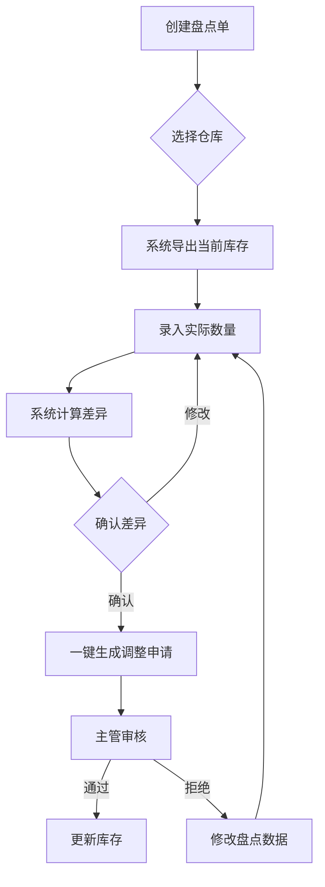
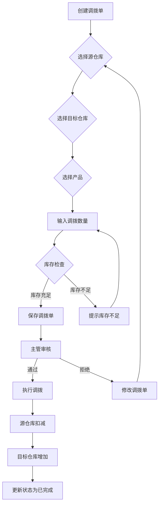
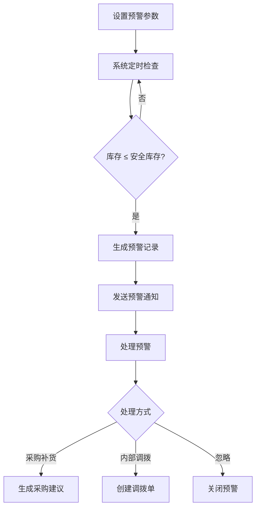
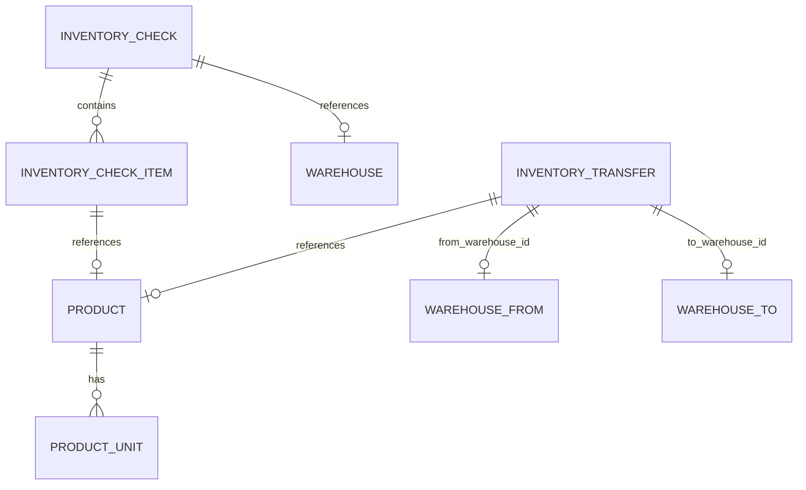

# 库存管理核心功能需求文档

## 1. 项目背景与目标

### 1.1 业务背景
当前ERP系统已实现基础的库存查询和调整功能，但缺少让库存"动起来"的核心操作能力，无法满足企业实际业务需求。根据业务调研，企业急需以下核心功能：
- 库存盘点：解决实际库存与系统账的差异
- 库存调拨：实现多仓库间的库存转移
- 库存预警：智能化库存管理
- 多计量单位：灵活的单位换算

### 1.2 项目目标
| 目标 | 描述 |
|------|------|
| 盘点效率提升 | 库存盘点时间缩短50% |
| 库存准确性 | 库存准确率达到99.5%以上 |
| 调拨效率 | 跨仓库调拨时间缩短至实时 |
| 预警响应 | 库存异常及时发现和处理 |

### 1.3 项目范围
- **新增功能**：库存盘点、库存调拨、库存预警配置、多计量单位
- **关联模块**：产品管理、仓库管理、库存管理

---

## 2. 用户画像与核心场景

### 2.1 目标用户群体

| 用户角色 | 职责描述 | 系统需求 |
|----------|----------|----------|
| **仓库管理员** | 负责库存盘点、调拨操作 | 创建盘点单、执行调拨、处理库存差异 |
| **采购专员** | 负责采购计划 | 查看库存预警、制定采购计划 |
| **销售专员** | 负责销售订单 | 查看实时库存、确认库存是否充足 |
| **仓库主管** | 负责审批和监控 | 审核盘点差异、审核调拨单 |

### 2.2 用户痛点分析

| 用户角色 | 痛点 | 解决方案 |
|----------|------|----------|
| 仓库管理员 | 手动盘点耗时费力，差异计算容易出错 | 批量盘点功能，自动计算盘盈盘亏 |
| 仓库主管 | 无法实时监控多仓库库存状态 | 库存预警功能，异常自动提醒 |
| 采购专员 | 不知道何时需要补货 | 安全库存预警，自动提示补货时机 |
| 销售专员 | 产品多单位换算复杂 | 多计量单位支持，自动换算 |

### 2.3 核心使用场景

**场景1：月度库存盘点**
- 仓库管理员创建盘点单，选择盘点仓库
- 系统自动导出当前仓库所有产品的系统库存
- 仓库人员录入实际盘点数量
- 系统自动计算盘盈/盘亏差异
- 确认差异后一键生成调整申请单
- 主管审核调整单，系统自动更新库存

**场景2：跨仓库调拨**
- 仓库管理员创建调拨单
- 选择源仓库、目标仓库、产品和数量
- 系统检查源仓库库存是否充足
- 主管审核调拨单
- 系统自动扣减源仓库库存，增加目标仓库库存

**场景3：库存预警处理**
- 系统定期检查库存数量
- 当库存低于安全库存时自动触发预警
- 采购专员收到预警通知
- 根据预警信息制定采购计划

---

## 3. 功能列表（附优先级）

### 3.1 P0 - 核心功能（必做）

| 功能模块 | 功能点 | 描述 | 验收标准 |
|----------|--------|------|----------|
| **库存盘点** | 创建盘点单 | 创建盘点任务，选择盘点仓库 | 生成唯一盘点单号 |
| | 批量录入 | 导入或批量录入实际盘点数量 | 支持Excel导入 |
| | 差异计算 | 自动计算盘盈/盘亏差异 | 差异 = 实际 - 系统 |
| | 生成调整单 | 根据差异一键生成调整申请 | 盘盈生成入库调整，盘亏生成出库调整 |
| **库存调拨** | 创建调拨单 | 选择源仓库、目标仓库、产品、数量 | 生成唯一调拨单号 |
| | 库存检查 | 自动检查源仓库库存是否充足 | 库存不足时提示 |
| | 调拨审核 | 主管审核调拨单 | 审核通过后自动执行调拨 |
| | 调拨执行 | 自动更新源仓库和目标仓库库存 | 源仓库扣减，目标仓库增加 |

### 3.2 P1 - 重要功能

| 功能模块 | 功能点 | 描述 | 验收标准 |
|----------|--------|------|----------|
| **库存预警** | 预警配置 | 设置产品的最高/最低/安全库存 | 支持按产品单独配置 |
| | 预警查询 | 查询当前库存预警列表 | 按预警级别筛选 |
| | 预警通知 | 库存低于阈值时自动提醒 | 支持系统内通知 |
| **多计量单位** | 单位配置 | 为产品配置多计量单位 | 支持主单位和辅助单位 |
| | 单位换算 | 自动进行单位换算 | 如：1箱 = 24瓶 |

### 3.3 P2 - 增值功能

| 功能模块 | 功能点 | 描述 | 验收标准 |
|----------|--------|------|----------|
| **库存盘点** | 盘点报告 | 生成盘点差异报告 | 包含盘盈盘亏汇总 |
| **库存调拨** | 调拨历史 | 查询调拨记录 | 支持按时间、仓库筛选 |
| **库存预警** | 预警规则 | 可配置预警触发条件 | 支持自定义预警级别 |

---

## 4. 业务流程

### 4.1 库存盘点流程



**流程说明：**

| 步骤 | 操作 | 角色 | 说明 |
|------|------|------|------|
| 1 | 创建盘点单 | 仓库管理员 | 选择要盘点的仓库 |
| 2 | 导出库存 | 系统 | 自动导出该仓库所有产品的系统库存 |
| 3 | 录入数量 | 仓库管理员 | 录入实际盘点数量 |
| 4 | 计算差异 | 系统 | 自动计算盘盈/盘亏 |
| 5 | 确认差异 | 仓库管理员 | 确认差异数据 |
| 6 | 生成调整单 | 系统 | 根据差异生成库存调整申请 |
| 7 | 审核调整 | 仓库主管 | 审核调整申请 |
| 8 | 更新库存 | 系统 | 审核通过后自动更新库存 |

### 4.2 库存调拨流程



**流程说明：**

| 步骤 | 操作 | 角色 | 说明 |
|------|------|------|------|
| 1 | 创建调拨单 | 仓库管理员 | 开始创建调拨任务 |
| 2 | 选择源仓库 | 仓库管理员 | 选择库存转出的仓库 |
| 3 | 选择目标仓库 | 仓库管理员 | 选择库存转入的仓库 |
| 4 | 选择产品 | 仓库管理员 | 选择要调拨的产品 |
| 5 | 输入数量 | 仓库管理员 | 输入调拨数量 |
| 6 | 库存检查 | 系统 | 检查源仓库库存是否充足 |
| 7 | 保存调拨单 | 系统 | 生成调拨单号 |
| 8 | 审核调拨 | 仓库主管 | 审核调拨申请 |
| 9 | 执行调拨 | 系统 | 自动更新两个仓库的库存 |

### 4.3 库存预警流程



---

## 5. 数据模型设计

### 5.1 新增数据表

#### 5.1.1 盘点单表 (inventory_checks)

| 字段名 | 类型 | 约束 | 说明 |
|--------|------|------|------|
| id | uint | PRIMARY KEY | 主键 |
| check_no | varchar(50) | NOT NULL, UNIQUE | 盘点单号（格式：CK-YYYYMMDD-0001） |
| warehouse_id | uint | NOT NULL, INDEX | 仓库ID |
| status | int | DEFAULT 1 | 状态（1:进行中, 2:已完成） |
| total_diff | int | DEFAULT 0 | 总差异数量 |
| remark | varchar(500) | | 备注 |
| created_at | datetime | | 创建时间 |
| updated_at | datetime | | 更新时间 |

#### 5.1.2 盘点明细表 (inventory_check_items)

| 字段名 | 类型 | 约束 | 说明 |
|--------|------|------|------|
| id | uint | PRIMARY KEY | 主键 |
| check_id | uint | NOT NULL, INDEX | 盘点单ID |
| product_id | uint | NOT NULL, INDEX | 产品ID |
| system_qty | int | NOT NULL | 系统库存数量 |
| actual_qty | int | NOT NULL | 实际盘点数量 |
| diff_qty | int | NOT NULL | 差异数量（实际-系统） |
| status | int | DEFAULT 1 | 状态（1:待处理, 2:已处理） |

#### 5.1.3 调拨单表 (inventory_transfers)

| 字段名 | 类型 | 约束 | 说明 |
|--------|------|------|------|
| id | uint | PRIMARY KEY | 主键 |
| transfer_no | varchar(50) | NOT NULL, UNIQUE | 调拨单号（格式：TF-YYYYMMDD-0001） |
| from_warehouse_id | uint | NOT NULL, INDEX | 源仓库ID |
| to_warehouse_id | uint | NOT NULL, INDEX | 目标仓库ID |
| product_id | uint | NOT NULL, INDEX | 产品ID |
| quantity | int | NOT NULL | 调拨数量 |
| status | int | DEFAULT 1 | 状态（1:待审核, 2:已审核, 3:已完成） |
| remark | varchar(500) | | 备注 |
| created_at | datetime | | 创建时间 |
| updated_at | datetime | | 更新时间 |

#### 5.1.4 计量单位表 (product_units)

| 字段名 | 类型 | 约束 | 说明 |
|--------|------|------|------|
| id | uint | PRIMARY KEY | 主键 |
| product_id | uint | NOT NULL, INDEX | 产品ID |
| unit_name | varchar(20) | NOT NULL | 单位名称（如箱、瓶、件） |
| ratio | decimal(10,4) | DEFAULT 1 | 与主单位的换算比例 |
| is_main | tinyint | DEFAULT 0 | 是否主单位（1:是, 0:否） |
| created_at | datetime | | 创建时间 |

### 5.2 修改数据表

#### 5.2.1 产品表 (products) - 新增字段

| 字段名 | 类型 | 约束 | 说明 |
|--------|------|------|------|
| min_stock | int | DEFAULT 0 | 最低库存 |
| max_stock | int | DEFAULT 99999 | 最高库存 |
| safety_stock | int | DEFAULT 0 | 安全库存 |

### 5.3 实体关系图



---

## 6. API接口设计

### 6.1 库存盘点接口

| 接口路径 | HTTP方法 | 功能描述 | 认证要求 |
|----------|----------|----------|----------|
| /inventory/check/create | POST | 创建盘点单 | 是 |
| /inventory/check/get/:id | GET | 获取盘点单详情 | 是 |
| /inventory/check/list | GET | 获取盘点单列表 | 是 |
| /inventory/check/update | POST | 更新盘点单 | 是 |
| /inventory/check/delete | POST | 删除盘点单 | 是 |
| /inventory/check/submit | POST | 提交盘点结果 | 是 |
| /inventory/check/generate-adjust | POST | 根据盘点差异生成调整申请 | 是 |

### 6.2 库存调拨接口

| 接口路径 | HTTP方法 | 功能描述 | 认证要求 |
|----------|----------|----------|----------|
| /inventory/transfer/create | POST | 创建调拨单 | 是 |
| /inventory/transfer/get/:id | GET | 获取调拨单详情 | 是 |
| /inventory/transfer/list | GET | 获取调拨单列表 | 是 |
| /inventory/transfer/update | POST | 更新调拨单 | 是 |
| /inventory/transfer/delete | POST | 删除调拨单 | 是 |
| /inventory/transfer/audit | POST | 审核调拨单 | 是 |
| /inventory/transfer/execute | POST | 执行调拨 | 是 |

### 6.3 库存预警接口

| 接口路径 | HTTP方法 | 功能描述 | 认证要求 |
|----------|----------|----------|----------|
| /inventory/alert/list | GET | 获取库存预警列表 | 是 |
| /inventory/alert/check | GET | 手动触发库存检查 | 是 |

### 6.4 计量单位接口

| 接口路径 | HTTP方法 | 功能描述 | 认证要求 |
|----------|----------|----------|----------|
| /product/unit/create | POST | 创建计量单位 | 是 |
| /product/unit/update | POST | 更新计量单位 | 是 |
| /product/unit/delete | POST | 删除计量单位 | 是 |
| /product/unit/list | GET | 获取产品计量单位列表 | 是 |

---

## 7. 异常场景处理

### 7.1 库存盘点异常

| 场景 | 处理方式 | 用户提示 |
|------|----------|----------|
| 盘点单已提交后修改 | 阻止修改 | "盘点单已提交，无法修改" |
| 实际数量为负数 | 校验失败 | "实际数量不能为负数" |
| 盘点单关联的调整单已审核 | 不允许删除盘点单 | "存在已审核的调整单，无法删除" |

### 7.2 库存调拨异常

| 场景 | 处理方式 | 用户提示 |
|------|----------|----------|
| 源仓库与目标仓库相同 | 校验失败 | "源仓库和目标仓库不能相同" |
| 源仓库库存不足 | 阻止提交 | "源仓库库存不足，无法调拨" |
| 已完成的调拨单修改 | 阻止修改 | "调拨单已完成，无法修改" |
| 目标仓库不存在 | 校验失败 | "目标仓库不存在" |

### 7.3 库存预警异常

| 场景 | 处理方式 | 用户提示 |
|------|----------|----------|
| 安全库存 > 最高库存 | 校验失败 | "安全库存不能大于最高库存" |
| 最低库存 > 安全库存 | 校验失败 | "最低库存不能大于安全库存" |

---

## 8. 数据埋点需求

### 8.1 用户行为数据收集

| 埋点名称 | 触发时机 | 收集字段 |
|----------|----------|----------|
| 创建盘点单 | 点击保存按钮 | user_id, warehouse_id, timestamp |
| 提交盘点结果 | 点击提交按钮 | user_id, check_id, total_diff |
| 创建调拨单 | 点击保存按钮 | user_id, from_warehouse_id, to_warehouse_id |
| 审核调拨单 | 点击审核按钮 | user_id, transfer_id, status |
| 执行调拨 | 点击执行按钮 | user_id, transfer_id, quantity |

### 8.2 业务指标监控

| 指标名称 | 计算方式 | 监控频率 |
|----------|----------|----------|
| 盘点完成率 | 已完成盘点单数/总盘点单数 | 每日 |
| 盘点准确率 | 无差异盘点数/总盘点数 | 每次盘点 |
| 调拨完成率 | 已完成调拨单数/总调拨单数 | 每日 |
| 库存预警次数 | 触发预警的产品数量 | 每日 |

---

## 9. 验收标准

### 9.1 功能验收标准

| 功能模块 | 验收要点 |
|----------|----------|
| 库存盘点 | 盘点单创建成功、差异计算准确、调整单生成正确 |
| 库存调拨 | 调拨单创建成功、库存检查有效、调拨执行正确更新库存 |
| 库存预警 | 预警配置保存成功、预警规则触发正确 |
| 计量单位 | 多单位配置成功、单位换算正确 |

### 9.2 性能验收标准

| 指标 | 验收标准 |
|------|----------|
| 盘点单生成时间 | < 2秒（1000条产品） |
| 调拨执行时间 | < 1秒 |
| 库存预警检查时间 | < 30秒（10000条产品） |

### 9.3 用户体验验收标准

| 指标 | 验收标准 |
|------|----------|
| 盘点操作步骤 | ≤ 5步完成一次盘点 |
| 调拨操作步骤 | ≤ 4步完成一次调拨 |
| 错误提示 | 清晰、可操作 |

---

## 10. 权限需求

### 10.1 功能权限矩阵

| 功能模块 | 仓库管理员 | 仓库主管 | 采购专员 | 销售专员 | 系统管理员 |
|----------|------------|----------|----------|----------|------------|
| 创建盘点单 | ✅ | ✅ | - | - | ✅ |
| 提交盘点结果 | ✅ | ✅ | - | - | ✅ |
| 查看盘点单 | ✅ | ✅ | ✅ | ✅ | ✅ |
| 创建调拨单 | ✅ | ✅ | - | - | ✅ |
| 审核调拨单 | - | ✅ | - | - | ✅ |
| 执行调拨 | ✅ | ✅ | - | - | ✅ |
| 设置库存预警 | - | ✅ | ✅ | - | ✅ |
| 配置计量单位 | - | - | - | - | ✅ |

### 10.2 权限编码规范

```
{模块}:{操作}

模块名: inventory_check, inventory_transfer, inventory_alert, product_unit
操作: create, view, update, delete, submit, audit, execute, configure

示例:
- inventory_check:create    # 创建盘点单
- inventory_check:submit    # 提交盘点结果
- inventory_transfer:create # 创建调拨单
- inventory_transfer:audit  # 审核调拨单
- inventory_transfer:execute # 执行调拨
- product_unit:configure    # 配置计量单位
```

---

## 11. 项目计划

### 11.1 开发阶段

| 阶段 | 时间 | 任务 |
|------|------|------|
| 需求分析 | 1周 | 需求评审、文档完善 |
| 后端开发 | 3周 | API开发、业务逻辑实现 |
| 前端开发 | 3周 | 页面开发、接口对接 |
| 测试验证 | 1周 | 功能测试、性能测试 |
| 部署上线 | 1周 | 环境部署、用户培训 |

### 11.2 里程碑

| 里程碑 | 完成时间 | 交付物 |
|--------|----------|--------|
| 需求文档完成 | 第1周 | PRD文档 |
| 后端API完成 | 第4周 | 后端代码、API文档 |
| 前端页面完成 | 第7周 | 前端代码 |
| 测试完成 | 第8周 | 测试报告 |
| 上线完成 | 第9周 | 部署文档、用户手册 |

---

**文档版本**: v1.0  
**创建日期**: 2026-05-06  
**状态**: 待评审